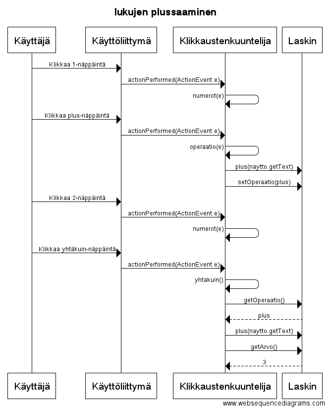
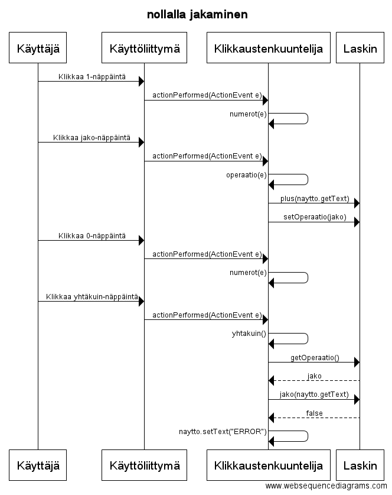

**Aihe:** Laskin. Tarkoituksena olisi tehdä laskin jossa näppäimet kaikille numeroille ja toiminnoille

**Tominnot:** 

* Yhteenlasku
* Vähennyslasku
* Kertolasku
* Jakolasku
* Memory-näppäimet

Luokkakaavio

